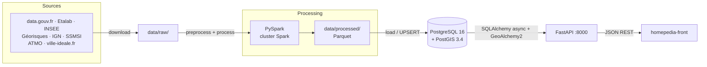
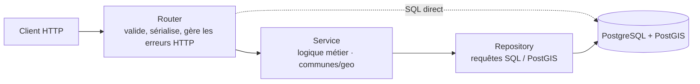
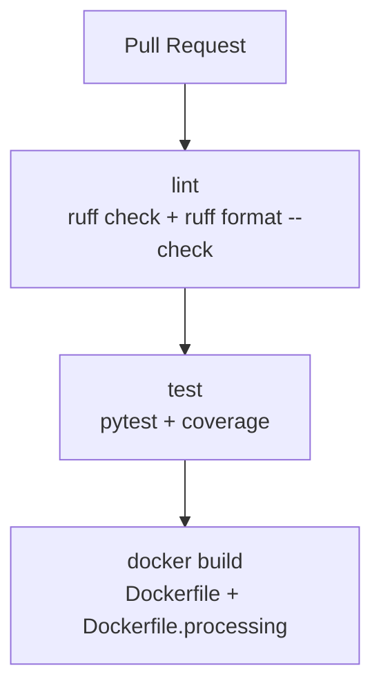

# Homepedia — Architecture technique (repo `homepedia-api`)

Décrit l'architecture réelle du backend : pipeline de données, API et infrastructure Docker.
Le frontend vit dans un repo séparé (`homepedia-front`) et n'est mentionné ici que comme
consommateur de l'API.

## Documents associés

| Doc | Contenu |
|-----|---------|
| [sources.md](sources.md) | Les 9 sources de données intégrées |
| [database.md](database.md) | Schéma SQL, PostGIS, indexation |
| [api-contrat.md](api-contrat.md) | Endpoints et schémas Pydantic |

---

## 1. Vue d'ensemble



Le pipeline et l'API partagent la même base PostgreSQL/PostGIS. Le pipeline écrit
(`load`), l'API lit.

---

## 2. Structure du repo

```
src/
    pipeline.py              # Orchestrateur CLI — registre SOURCES, commandes run/run-all/...
    sources/                 # Une source = un dossier autonome
        base.py              # Interface DataSource (ABC) : download → preprocess → process → load
        utils.py             # Utilitaires HTTP partagés
        geo/ bpe/ dvf/ iris/ ville_ideale/ crime/ education/ risques/ qualite_air/
            config.py        # Constantes : URLs, chemins, colonnes attendues
            download.py      # Étape 1 — récupère les fichiers bruts → data/raw/
            preprocess.py    # Étape 2 — valide / nettoie
            process.py       # Étape 3 — job Spark → Parquet dans data/processed/
            load.py          # Étape 4 — Parquet → PostgreSQL
            source.py        # Classe <Nom>Source(DataSource) qui câble les 4 étapes
    processing/
        spark_utils.py       # Helper SparkSession partagé (local[*] ou cluster)
    database/
        postgres_schema.sql  # Schéma SQL (monté en docker-entrypoint-initdb.d)
    api/
        main.py              # App FastAPI, CORS, montage des routers, /health
        config.py            # Settings + engine async + get_db()
        dependencies.py      # Depends : get_commune_service, get_geo_service (+ repos)
        routers/             # communes, geo, prix, reviews, risques, qualite_air,
                             #   securite, education, bpe
        services/            # commune_service, geo_service
        repositories/        # commune_repository, geo_repository, interfaces
        schemas/             # commune, geo, pagination (Pydantic v2)
        models/              # base (SQLAlchemy DeclarativeBase)

data/raw/                    # Fichiers bruts téléchargés (non versionné)
data/processed/              # Parquet produits par Spark (non versionné)
tests/                       # pytest (sources + api)
ci/scripts/                  # Utilitaires CI
Dockerfile                   # Image API (uvicorn)
Dockerfile.processing        # Image pipeline (PySpark + Java)
docker-compose.yml           # db + spark (master/2 workers) + processing + api
Makefile                     # Cibles setup / all / pipeline / test / ...
pyproject.toml               # Poetry (groupes : main, bigdata, scraping, utils, dev)
```

---

## 3. Pipeline de données

Chaque source implémente les 4 étapes de `DataSource` ([`src/sources/base.py`](../src/sources/base.py)),
orchestrées par [`src/pipeline.py`](../src/pipeline.py) :

```
download → preprocess → process (Spark → Parquet) → load (→ PostgreSQL)
```

Les sources sont enregistrées dans le dictionnaire `SOURCES` du pipeline. Résumé
(détails et fournisseurs : [sources.md](sources.md)) :

| Source | Table(s) PostgreSQL | Endpoint API |
|--------|---------------------|--------------|
| `geo` | `regions`, `departements`, `communes` | `/api/v1/communes/*`, `/api/v1/geo/*` |
| `bpe` | `bpe_commune_stats` | `/api/v1/equipements/{code}` |
| `dvf` | `dvf_transactions`, `price_trends` | `/api/v1/prix/points` |
| `iris` | `iris_quartiers` | `/api/v1/geo/iris` |
| `ville_ideale` | `city_reviews` | `/api/v1/reviews/{code}` |
| `crime` | `securite_commune` | `/api/v1/securite/{code}` |
| `education` | `education_commune` | `/api/v1/education/{code}` |
| `risques` | `commune_risques`, `risques_geopoints` | `/api/v1/risques/*` |
| `qualite_air` | `commune_qualite_air` | `/api/v1/qualite-air/{code}` |

> `geo` est la source socle : elle crée le référentiel `communes` (contrainte de clé
> étrangère `code_commune` pour toutes les autres). La charger en premier.

---

## 4. Architecture backend

L'API est **async** (FastAPI + SQLAlchemy `asyncpg`). Deux styles coexistent :

- **`communes` et `geo`** suivent le pattern 3 couches Router → Service → Repository
  (interfaces dans `repositories/interfaces.py`, injection via `dependencies.py`).
- **Les routers thématiques** (`prix`, `reviews`, `risques`, `qualite_air`, `securite`,
  `education`, `equipements`) exécutent directement des requêtes SQL paramétrées
  (`sqlalchemy.text`) sur la session `get_db`, et définissent leurs schémas Pydantic en local.



> Il n'y a **pas de couche de cache** applicative : chaque requête frappe PostgreSQL.
> Les avis (`/reviews`) sont l'exception : lecture *cache-first* dans `city_reviews`
> avec scraping à la demande sur cache miss (TTL 30 jours).

---

## 5. Infrastructure Docker

Un seul `docker-compose.yml` définit tous les services du repo :

| Service | Image / build | Rôle | Ports |
|---------|---------------|------|-------|
| `db` | `postgis/postgis:16-3.4` | PostgreSQL + PostGIS, init via `postgres_schema.sql` | 5432 |
| `spark-master` | `apache/spark:3.5.5` | Master du cluster Spark | 7077, 8080 |
| `spark-worker-1` / `spark-worker-2` | `apache/spark:3.5.5` | Workers Spark | — |
| `processing` | `Dockerfile.processing` | Exécute le pipeline (`python -m src.pipeline ...`) | — |
| `api` | `Dockerfile` | FastAPI / uvicorn | 8000 |

- Le schéma SQL est monté en `docker-entrypoint-initdb.d` → créé au premier démarrage de `db`.
- `processing` tourne par défaut en `local[*]`. Pour soumettre au cluster :
  `docker compose run -e SPARK_MASTER_URL=spark://spark-master:7077 processing ...`.
- Deux images distinctes : l'API n'embarque pas PySpark/Java (groupe `main` seulement),
  le pipeline embarque `main,bigdata,scraping`.

Voir le [README](../README.md) pour les commandes (`make setup`, `make all`, `make pipeline`).

---

## 6. CI (GitHub Actions)

`.github/workflows/ci.yml` s'exécute sur chaque PR vers `main` ou `dev` et enchaîne 3 jobs :



| Job | Outil | Commande |
|-----|-------|----------|
| `lint` | Ruff | `ruff check src/ tests/` + `ruff format --check src/ tests/` |
| `test` | pytest | `pytest tests/ -v --cov=src` |
| `docker` | docker build | build des deux images |

Les mêmes checks sont rejouables en local via `make ci`, et en pre-commit
(voir [`.pre-commit-config.yaml`](../.pre-commit-config.yaml)).
