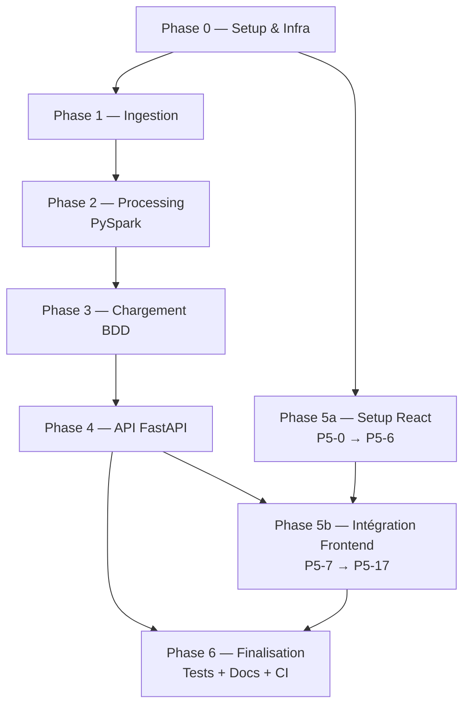
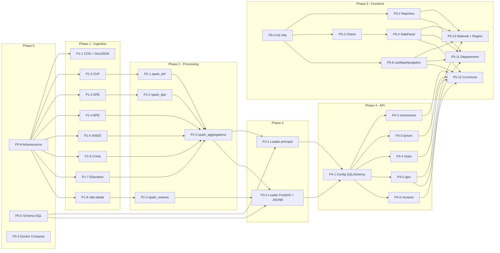

# Homepedia -- Backlog

> **Légende taille** : S = Small (~2h) | M = Medium (~4h) | L = Large (~1j) | XL = Extra Large (~2j+)
> **Légende priorité** : P0 = Critique (bloquant) | P1 = Important | P2 = Secondaire

---

## Phase 0 : Setup & Infrastructure

| ID | Taille | Priorité | Tâche | Statut |
|----|--------|----------|-------|--------|
| P0-1 | S | P0 | Initialiser repo Git + `.gitignore` (data/, .env, __pycache__, .venv/, *.pyc, .DS_Store) | [ ] |
| P0-2 | S | P0 | Créer `pyproject.toml` (Poetry) avec toutes les dépendances backend | [ ] |
| P0-3 | M | P0 | Créer `docker-compose.yml` (PostgreSQL 16 + PostGIS 3.4, Spark 1 master + 2 workers) | [ ] |
| P0-4 | S | P0 | Créer `.env.example` avec variables de connexion DB | [ ] |
| P0-5 | L | P0 | Créer `src/database/postgres_schema.sql` (tables dimension, faits, analytiques, JSONB, index) | [ ] |
| P0-7 | M | P1 | Créer `Makefile` (targets: setup, ingest, process, load, api, frontend, update, all) | [ ] |
| P0-8 | S | P1 | Écrire `README.md` (installation, lancement, architecture) | [ ] |
| P0-9 | S | P0 | Créer l'arborescence complète du projet | [ ] |

---

## Phase 1 : Ingestion des données

### Données gouvernementales (Open Data)

| ID | Taille | Priorité | Tâche | Dépendance | Statut |
|----|--------|----------|-------|------------|--------|
| P1-1 | M | P0 | `download_geo.py` — COG + contours GeoJSON (3-6 fichiers par niveau géo) | P0-9 | [ ] |
| P1-2 | L | P0 | `download_dvf.py` — **~12 fichiers** : Geo-DVF 2020-2025 (UTF-8) + DVF brut 2014-2019 (Latin-1, `\|`) | P0-9 | [ ] |
| P1-3 | L | P0 | `download_dpe.py` — **2 fichiers, formats incompatibles** : nouveau CSV (~9M) + ancien dump MySQL (~10.7M) | P0-9 | [ ] |
| P1-4 | M | P1 | `download_bpe.py` — BPE, 1 fichier (~2M lignes, 229 types équipements) | P0-9 | [ ] |
| P1-5 | M | P1 | `download_insee.py` — 3 fichiers : FiLoSoFi (XLSX) + populations (XLSX 1968-2023) + France Travail (CSV 2015-2024) | P0-9 | [ ] |
| P1-5b | S | P0 | `download_loyers.py` — **4 fichiers CSV** (apparts, maisons, apparts 3+, apparts 1-2) ~140K lignes | P0-9 | [ ] |
| P1-6 | S | P1 | `download_crime.py` — 1 fichier Parquet (~4.7M lignes, format long 2016-2025) | P0-9 | [ ] |
| P1-7 | S | P1 | `download_education.py` — 2 fichiers CSV : DNB + IVAL | P0-9 | [ ] |

### Scraping

| ID | Taille | Priorité | Tâche | Dépendance | Statut |
|----|--------|----------|-------|------------|--------|
| P1-8 | XL | P0 | `ville_ideale_scraper.py` — ~91K avis, 8 critères + commentaires | P0-9 | [ ] |
| P1-9 | L | P1 | `pap_scraper.py` — ~5-10K annonces | P0-9 | [ ] |

### Données complémentaires (P1/P2)

| ID | Taille | Priorité | Tâche | Dépendance | Statut |
|----|--------|----------|-------|------------|--------|
| P1-10 | S | P1 | `download_lovac.py` — 1 fichier CSV, logements vacants 2020-2025 (~35K lignes) | P0-9 | [ ] |
| P1-11 | S | P1 | `download_zonage.py` — 1 fichier CSV, zonage ABC (~35K lignes) | P0-9 | [ ] |
| P1-12 | S | P1 | `download_rei.py` — **1 ZIP/an**, impôts locaux REI (~35K × 1101 col, Latin-1) | P0-9 | [ ] |
| P1-13 | S | P1 | `download_internet.py` — **4 fichiers CSV** : `commune.csv`, `commune_techno.csv`, `commune_debit.csv`, `commune_meilleure_techno_thd.csv` | P0-9 | [ ] |
| P1-14 | M | P1 | `download_georisques.py` — API REST, ~35K appels batch (1/commune) | P0-9 | [ ] |
| P1-15 | S | P1 | `download_ensoleillement.py` — 1 fichier CSV (92 départements) | P0-9 | [ ] |
| P1-16 | S | P1 | `download_eau.py` — **2 XLS/an** : `tarifs_AEP_{YEAR}.xls` + `tarifs_AC_{YEAR}.xls` (~33 600 communes) | P0-9 | [ ] |
| P1-17 | S | P1 | `download_apl.py` — 1 fichier XLSX, APL médecins (DREES) | P0-9 | [ ] |
| P1-18 | S | P2 | `download_rpls.py` — 1 fichier CSV, logements sociaux (~5M lignes) | P0-9 | [ ] |
| P1-19 | M | P2 | `download_comptes.py` — 1 fichier CSV (6.8 GB, 22M lignes, format long 2017-2024) | P0-9 | [ ] |
| P1-20 | S | P2 | `download_politique.py` — 1 fichier CSV, nuance politique du maire | P0-9 | [ ] |
| P1-21 | M | P2 | `download_navettes.py` — 1 ZIP avec CSV (~70 MB, 1.2M lignes, format long) | P0-9 | [ ] |

---

## Phase 2 : Traitement Big Data (PySpark)

| ID | Taille | Priorité | Tâche | Dépendance | Statut |
|----|--------|----------|-------|------------|--------|
| P2-1 | XL | P0 | `spark_dvf.py` — Nettoyage DVF (encodage, dédup, prix/m², anomalies) → Parquet | P1-2 | [ ] |
| P2-2 | L | P0 | `spark_dpe.py` — Normalisation DPE (classes A-G, agrégation commune) → Parquet | P1-3 | [ ] |
| P2-3 | XL | P0 | `spark_aggregations.py` — Jointures multi-sources, price_trends, stats communales | P2-1, P2-2, P1-4..P1-7 | [ ] |
| P2-4 | M | P1 | `spark_reviews.py` — Agrégation notes, fréquences mots basique | P1-8 | [ ] |

---

## Phase 3 : Chargement en base

| ID | Taille | Priorité | Tâche | Dépendance | Statut |
|----|--------|----------|-------|------------|--------|
| P3-1 | L | P0 | `postgres_loader.py` — Tables dimension + faits + analytiques (UPSERT) | P2-3, P0-5 | [ ] |
| P3-2 | L | P1 | Étendre loader — PostGIS (GeoJSON → ST_GeomFromGeoJSON) + JSONB (avis, annonces) | P2-3, P2-4, P0-5 | [ ] |

---

## Phase 4 : API Backend (FastAPI)

| ID | Taille | Priorité | Tâche | Dépendance | Statut |
|----|--------|----------|-------|------------|--------|
| P4-1 | M | P0 | Config SQLAlchemy async + GeoAlchemy2 + .env | P3-1, P3-2 | [ ] |
| P4-2 | M | P0 | `routers/communes.py` — recherche, fiche commune | P4-1 | [ ] |
| P4-3 | M | P0 | `routers/prices.py` — prix par commune, tendances par département | P4-1 | [ ] |
| P4-4 | M | P1 | `routers/stats.py` — stats socio-économiques complètes | P4-1 | [ ] |
| P4-5 | L | P0 | `routers/geo.py` — GeoJSON bbox, choropleth PostGIS | P4-1 | [ ] |
| P4-6 | M | P1 | `routers/reviews.py` — avis JSONB, notes, word cloud | P4-1 | [ ] |

---

## Phase 5 : Frontend React

### Setup et composants réutilisables

| ID | Taille | Priorité | Tâche | Dépendance | Statut |
|----|--------|----------|-------|------------|--------|
| P5-0 | S | P0 | Init Vite + TypeScript + dépendances + proxy API | — | [ ] |
| P5-1 | M | P0 | `Layout.tsx` — Navbar, recherche, structure responsive | P5-0 | [ ] |
| P5-2 | L | P0 | `MapView.tsx` — Carte choropleth/bubble (react-map-gl) | P5-0 | [ ] |
| P5-3 | L | P0 | `Charts.tsx` — LineChart, BarChart, RadarChart, BoxPlot (Recharts) | P5-0 | [ ] |
| P5-4 | M | P0 | `SidePanel.tsx` — Panneau latéral contextuel par viewLevel | P5-3 | [ ] |
| P5-5 | M | P1 | `Filters.tsx` + `Breadcrumb.tsx` — Filtres + navigation | P5-0 | [ ] |
| P5-6 | S | P1 | Assets + Tailwind config (thème, responsive) | P5-0 | [ ] |

### Application et intégration

| ID | Taille | Priorité | Tâche | Dépendance | Statut |
|----|--------|----------|-------|------------|--------|
| P5-7 | M | P0 | `App.tsx` + Providers (Filter, MapNavigation) | P5-0, P5-1 | [ ] |
| P5-8 | M | P0 | `useMapNavigation.ts` — viewLevel, navigateTo, goBack | P5-7 | [ ] |
| P5-9 | M | P0 | Hooks + API client (useCommune, usePrices, useStats, fetchApi) | P5-7 | [ ] |
| P5-10 | L | P0 | Intégration viewLevel national + region | P4-5, P5-2..P5-4, P5-8 | [ ] |
| P5-11 | L | P0 | Intégration viewLevel departement | P4-5, P5-2..P5-4, P5-8 | [ ] |
| P5-12 | XL | P0 | Intégration viewLevel commune (fiche détaillée avec onglets) | P4-2..P4-6, P5-3, P5-4, P5-8 | [ ] |
| P5-13 | M | P1 | `WordCloud.tsx` — Word cloud basique | P4-6, P5-12 | [ ] |
| P5-14 | M | P1 | `TendancesView.tsx` — Comparaison multi-communes | P5-3, P5-8, P5-9 | [ ] |
| P5-15 | M | P1 | `ComparaisonView.tsx` — Radar multi-critères | P5-3, P5-8, P5-9 | [ ] |
| P5-16 | M | P1 | `EnergieView.tsx` — Carte DPE + distribution | P5-2, P5-3, P5-8 | [ ] |
| P5-17 | M | P1 | `AvisView.tsx` — WordCloud + radar notes | P5-8, P5-13 | [ ] |

---

## Phase 6 : Finalisation

| ID | Taille | Priorité | Tâche | Dépendance | Statut |
|----|--------|----------|-------|------------|--------|
| P6-1 | L | P1 | Tests unitaires (ingestion, processing, API) | Phases 1-4 | [ ] |
| P6-2 | L | P1 | Tests d'intégration (pipeline complet) | Tout | [ ] |
| P6-3 | M | P1 | Documentation méthodologie de nettoyage | Phase 2 | [ ] |
| P6-4 | M | P1 | Documentation schéma de base de données | Phase 3 | [ ] |
| P6-5 | S | P2 | Documentation traitement des avis | P2-4 | [ ] |
| P6-6 | L | P1 | Optimisation performances (cache, pagination, index) | Phases 4-5 | [ ] |
| P6-7 | M | P0 | Docker final : `docker-compose up` lance tout | Tout | [ ] |
| P6-8 | M | P2 | `update_all.py` — Mise à jour incrémentale (--since) | Phase 1 | [ ] |
| P6-9 | M | P2 | `docs/architecture_scalabilite.md` — Airflow, Kafka | — | [ ] |

---

## Bonus

| ID | Taille | Priorité | Tâche | Statut |
|----|--------|----------|-------|--------|
| B-1 | M | P2 | Authentification JWT (FastAPI) | [ ] |
| B-2 | L | P2 | Déploiement en ligne (à définir) | [ ] |
| B-3 | L | P2 | Vue admin serveur (monitoring Spark) | [ ] |
| B-4 | M | P2 | Mises à jour temps réel (APScheduler) | [ ] |
| B-5 | S | P2 | Visite guidée de l'application | [ ] |
| B-6 | XL | P2 | Extension à d'autres pays | [ ] |
| B-7 | XL | P2 | Pipeline NLP avancé (spaCy, CamemBERT, sentiment) | [ ] |

---

## Diagramme de dépendances (phases)

## Diagramme de dépendances (tâches détaillées)

