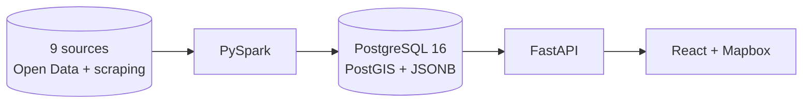
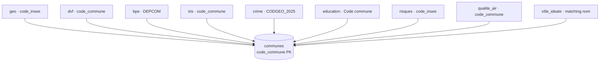
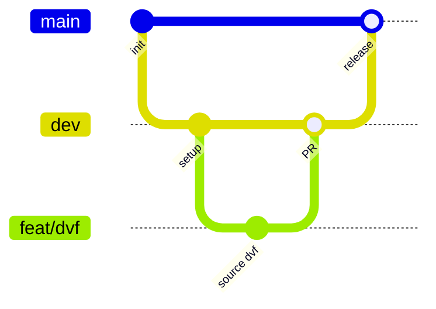

# Homepedia — Cadrage projet

> **Module** : T-DAT-902 (Epitech Big Data)
> **Rendu** : 5 juillet 2026

---

## 1. Contexte et objectifs

Homepedia est une plateforme d'analyse du marché immobilier français : collecter, traiter et
visualiser des données immobilières et socio-économiques à différentes échelles (nationale,
régionale, départementale, communale).

### Objectifs

- **Agréger** des données publiques multi-sources (transactions, équipements, sécurité,
  éducation, risques, qualité de l'air, avis habitants)
- **Traiter** de gros volumes via un pipeline Big Data (PySpark)
- **Stocker** dans une base unique PostgreSQL + PostGIS + JSONB
- **Exposer** via une API REST (FastAPI)
- **Visualiser** via une interface cartographique interactive (React + Mapbox, repo `homepedia-front`)

---

## 2. Périmètre

### Réalisé

| Fonctionnalité | Description |
|----------------|-------------|
| Pipeline données | download → preprocess → process (PySpark) → load PostgreSQL, orchestré par `src/pipeline.py` |
| 9 sources | geo, bpe, dvf, iris, ville_ideale, crime, education, risques, qualite_air (voir [sources.md](sources.md)) |
| API FastAPI | communes, geo (IRIS), prix (DVF), reviews, risques, qualité de l'air, sécurité, éducation, équipements |
| Traitement avis | Notes agrégées + word cloud (NLP léger stdlib) sur ville-ideale.fr, scraping à la demande |
| CI/CD | GitHub Actions : ruff (lint + format) + pytest + docker build |

### Hors périmètre

- Pas de NLP avancé (spaCy / CamemBERT) : le word cloud utilise un traitement en bibliothèque
  standard (tokenisation + stop-words FR).
- Pas de déploiement en ligne (Docker local uniquement).

---

## 3. Décisions techniques

### Base de données unique : PostgreSQL + PostGIS + JSONB

- **PostGIS** pour le géospatial (contours GeoJSON, index GiST, requêtes bbox)
- **JSONB** pour les données non-tabulaires (avis, word clouds, index GIN)
- **Pas de MongoDB** : les JOINs cross-domain, l'infra simplifiée et la supériorité de PostGIS
  sur MongoDB 2dsphere justifient ce choix

### Big Data : PySpark (unifié)

- **PySpark** pour toutes les sources — DVF (~10M lignes) est la plus lourde
- **Cluster Spark local** via Docker : 1 master + 2 workers
- Pipeline **batch** (pas temps réel) : exécuté ponctuellement, données ensuite servies depuis PostgreSQL
- **Framework unique** : compatibilité garantie sur machines hétérogènes, spill-to-disk si mémoire insuffisante

### Backend : FastAPI

- Cohérent avec le stack data Python (PySpark, scraping)
- Async natif, Pydantic v2, SQLAlchemy + GeoAlchemy2
- `communes` et `geo` suivent le pattern Router → Service → Repository ; les routers thématiques
  requêtent PostgreSQL directement (voir [architecture.md](architecture.md))

### Architecture microservices (2 repos)

- **`homepedia-api`** : backend (FastAPI + pipeline + database)
- **`homepedia-front`** : frontend (React + Vite + TypeScript)
- Chaque service est dockerisé ; communication HTTP REST via `VITE_API_URL`

### Clé de jointure universelle

**`code_commune` INSEE (5 caractères)** — toutes les sources sont jointes via ce code sur la
table de référence `communes`.

---

## 4. Sources de données

Le détail (fournisseur, URL, volume, tables) est dans **[sources.md](sources.md)**. En résumé,
9 sources intégrées : `geo`, `bpe`, `dvf`, `iris`, `ville_ideale`, `crime`, `education`,
`risques`, `qualite_air`.

Points d'attention :

- Paris / Lyon / Marseille ont des arrondissements (codes spéciaux)
- Fusions de communes → codes qui changent (utiliser le COG à jour)
- Scraping ville-ideale.fr : respect des CGU, rate-limiting, récupération à la demande

---

## 5. Contraintes

- **Budget** : 0 € — tout gratuit et open-source
- **Données** : les plus récentes possibles
- **Infra** : Docker local (microservices), configs prêtes pour un déploiement futur
- **Légalité** : respect strict des CGU pour le scraping (rate-limiting, robots.txt)

---

## 6. Stratégie de branches

- `main` : branche stable (releases)
- `dev` : branche d'intégration — **toutes les branches de travail partent de `dev`**
- `feat/*`, `fix/*`, `refactor/*` : une branche par tâche, mergée dans `dev` via PR

