# Schéma Base de Données

> **PostgreSQL 16 + PostGIS 3.4 + JSONB**
>
> Extrait de [architecture.md](architecture.md) — sections 4 et 7.

---

## Schéma relationnel

```mermaid
erDiagram
    regions ||--o{ departements : "1:N"
    departements ||--o{ communes : "1:N"
    departements ||--|| departement_ensoleillement : "1:1"
    communes ||--o{ dvf_transactions : "1:N (~25M)"
    communes ||--o{ dpe_diagnostics : "1:N (~9M)"
    communes ||--o{ price_trends : "1:N (pré-calculé)"
    communes ||--|| commune_statistics : "1:1"
    communes ||--|| commune_equipements : "1:1"
    communes ||--o{ commune_criminalite : "1:N (par année)"
    communes ||--o{ commune_education : "1:N (par année)"
    communes ||--|| commune_impots : "1:1"
    communes ||--o{ commune_loyers : "1:N (par type)"
    communes ||--o{ commune_logements_vacants : "1:N (par année)"
    communes ||--|| commune_zonage_abc : "1:1"
    communes ||--o{ commune_comptes : "1:N (par année)"
    communes ||--|| commune_internet : "1:1"
    communes ||--|| commune_risques : "1:1"
    communes ||--|| commune_eau : "1:1"
    communes ||--|| commune_apl : "1:1"
    communes ||--|| commune_politique : "1:1"
    communes ||--o{ rpls_logements : "1:N (~5M)"
    communes ||--|| city_reviews : "1:1 (JSONB)"
    communes ||--o{ listings : "1:N (JSONB)"
    communes ||--o{ parcelles_cadastrales : "1:N (~70M)"
    communes ||--o{ iris_quartiers : "1:N (~16.5k)"

    regions {
        varchar code_region PK
        varchar nom
        geometry geom "PostGIS MultiPolygon"
    }
    departements {
        varchar code_departement PK
        varchar nom
        varchar code_region FK
        geometry geom "PostGIS MultiPolygon"
    }
    communes {
        varchar code_commune PK "clé universelle INSEE 5 chars"
        varchar nom
        varchar code_departement FK
        varchar code_region FK
        integer population
        geometry geom "PostGIS MultiPolygon"
        geometry geom_simplified "PostGIS simplifié"
    }
    dvf_transactions {
        serial id PK
        varchar code_commune FK
        date date_mutation
        varchar type_local
        float valeur_fonciere
        float prix_m2 "calculé"
        geometry geom "PostGIS Point"
    }
    parcelles_cadastrales {
        varchar id PK "ex: 75101000AB0002"
        varchar code_commune FK
        varchar section
        varchar numero
        integer contenance "m²"
        geometry geom "PostGIS Polygon"
    }
    iris_quartiers {
        varchar code_iris PK "9 chars: commune + iris"
        varchar code_commune FK
        varchar nom_iris
        char type_iris "H/A/D/Z"
        geometry geom "PostGIS MultiPolygon"
    }
    city_reviews {
        varchar code_commune PK
        jsonb ratings "INDEX GIN"
        jsonb word_cloud "INDEX GIN"
        float note_globale
    }
```



---

## Tables de dimension (COG)

> **Arrondissements municipaux** : Paris (75101-75120), Lyon (69381-69389) et Marseille (13201-13216) sont insérés dans la table `communes` au même titre que les communes. Ils ont leur propre `code_commune`, géométrie et nom. Le cadastre et d'autres sources (DVF, DPE) utilisent ces codes d'arrondissement, pas le code commune global (75056, 69123, 13055).

```sql
communes (
    code_commune VARCHAR(5) PRIMARY KEY,
    nom VARCHAR(255),
    code_departement VARCHAR(3),
    code_region VARCHAR(3),
    code_postal VARCHAR(5),
    population INTEGER,
    superficie FLOAT,                     -- km²
    densite FLOAT,                        -- hab/km²
    latitude FLOAT,
    longitude FLOAT,
    geom GEOMETRY(MultiPolygon, 4326),              -- PostGIS, INDEX GIST
    geom_simplified GEOMETRY(MultiPolygon, 4326)    -- INDEX GIST
);

departements (
    code_departement VARCHAR(3) PRIMARY KEY,
    nom VARCHAR(255),
    code_region VARCHAR(3),
    geom GEOMETRY(MultiPolygon, 4326)    -- INDEX GIST
);

regions (
    code_region VARCHAR(3) PRIMARY KEY,
    nom VARCHAR(255),
    geom GEOMETRY(MultiPolygon, 4326)    -- INDEX GIST
);
```

---

## Cadastre (parcelles)

```sql
parcelles_cadastrales (
    id VARCHAR(20) PRIMARY KEY,          -- ex: "75101000AB0002"
    code_commune VARCHAR(5),             -- FK, INDEX
    prefixe VARCHAR(3),
    section VARCHAR(2),                  -- INDEX
    numero VARCHAR(4),
    contenance INTEGER,                  -- m²
    created DATE,
    updated DATE,
    geom GEOMETRY(Polygon, 4326)         -- INDEX GIST
);
```

> Source : [cadastre.data.gouv.fr](https://cadastre.data.gouv.fr) (Etalab)
> Volume : ~70M parcelles, GeoJSON par département

---

## IRIS (quartiers infra-communaux)

```sql
iris_quartiers (
    code_iris VARCHAR(9) PRIMARY KEY,        -- code_commune (5) + IRIS (4), ex: "751010101"
    code_commune VARCHAR(5),                 -- FK, INDEX
    nom_iris VARCHAR(255),                   -- ex: "Quartier Saint-Germain"
    type_iris CHAR(1),                       -- H=habitat, A=activité, D=divers, Z=non découpé
    geom GEOMETRY(MultiPolygon, 4326)        -- INDEX GIST
);
```

> Source : [IGN Contours IRIS](https://geoservices.ign.fr/contoursiris) (INSEE/IGN)
> Volume : ~16 500 IRIS, Shapefile France entière
> Découpage infra-communal (~2 000 hab/IRIS) pour communes de 5 000+ habitants

---

## Tables de faits (gros volumes)

```sql
dvf_transactions (
    id SERIAL PRIMARY KEY,
    id_mutation VARCHAR(20),
    code_commune VARCHAR(5),             -- FK, INDEX
    date_mutation DATE,                  -- INDEX
    nature_mutation VARCHAR(30),
    type_local VARCHAR(50),              -- INDEX
    valeur_fonciere FLOAT,
    surface_reelle_bati FLOAT,
    nb_pieces INTEGER,
    surface_terrain FLOAT,
    prix_m2 FLOAT,                       -- calculé
    longitude FLOAT,
    latitude FLOAT,
    geom GEOMETRY(Point, 4326)           -- INDEX GIST
);

dpe_diagnostics (
    id SERIAL PRIMARY KEY,
    code_commune VARCHAR(5),             -- FK, INDEX
    classe_energie CHAR(1),              -- A-G
    consommation_moyenne FLOAT,          -- kWh/m²/an
    date_diagnostic DATE
);
```

---

## Tables analytiques pré-calculées

```sql
price_trends (
    code_commune VARCHAR(5),
    annee INTEGER,
    trimestre INTEGER,                   -- 1-4
    type_local VARCHAR(50),
    prix_median_m2 FLOAT,
    nb_transactions INTEGER,
    variation_annuelle_pct FLOAT,
    PRIMARY KEY (code_commune, annee, trimestre, type_local)
);

commune_statistics (
    code_commune VARCHAR(5) PRIMARY KEY,
    annee INTEGER,
    population INTEGER,
    revenu_median FLOAT,
    taux_pauvrete FLOAT,
    taux_chomage FLOAT,
    nb_demandeurs_emploi INTEGER
);

commune_equipements (
    code_commune VARCHAR(5) PRIMARY KEY,
    nb_ecoles INTEGER, nb_colleges INTEGER, nb_lycees INTEGER,
    nb_medecins INTEGER, nb_dentistes INTEGER, nb_pharmacies INTEGER,
    nb_hopitaux INTEGER, nb_gares INTEGER, nb_supermarches INTEGER,
    nb_total INTEGER
);

commune_criminalite (
    code_commune VARCHAR(5),
    annee INTEGER,
    violences_intrafamiliales INTEGER,
    violences_hors_familial INTEGER,
    violences_sexuelles INTEGER,
    vols_armes INTEGER,
    vols_violents_sans_arme INTEGER,
    vols_sans_violence INTEGER,
    cambriolages INTEGER,
    vols_vehicules INTEGER,
    vols_dans_vehicules INTEGER,
    vols_accessoires_vehicules INTEGER,
    destructions_degradations INTEGER,
    escroqueries INTEGER,
    trafic_stupefiants INTEGER,
    usage_stupefiants INTEGER,
    usage_stupefiants_afd INTEGER,
    total_faits INTEGER,
    population INTEGER,
    taux_pour_mille FLOAT,
    PRIMARY KEY (code_commune, annee)
);

commune_education (
    code_commune VARCHAR(5),
    annee INTEGER,
    nb_colleges INTEGER, nb_presents_dnb INTEGER, nb_admis_dnb INTEGER,
    taux_reussite_dnb FLOAT,
    nb_lycees INTEGER, nb_presents_bac INTEGER, taux_reussite_bac FLOAT,
    PRIMARY KEY (code_commune, annee)
);

commune_impots (
    code_commune VARCHAR(5) PRIMARY KEY,
    annee INTEGER,
    taux_taxe_fonciere FLOAT,
    base_taxe_fonciere FLOAT,
    nb_logements_imposes INTEGER
);

commune_loyers (
    code_commune VARCHAR(5),
    type_bien VARCHAR(20),
    loyer_m2 FLOAT,
    loyer_m2_bas FLOAT,
    loyer_m2_haut FLOAT,
    type_prediction VARCHAR(10),
    nb_observations INTEGER,
    PRIMARY KEY (code_commune, type_bien)
);

commune_logements_vacants (
    code_commune VARCHAR(5),
    annee INTEGER,
    nb_logements_total INTEGER,
    nb_vacants INTEGER,
    nb_vacants_longue_duree INTEGER,
    taux_vacance FLOAT,
    PRIMARY KEY (code_commune, annee)
);

commune_zonage_abc (
    code_commune VARCHAR(5) PRIMARY KEY,
    zone VARCHAR(4),                     -- A, Abis, B1, B2, C
    reclassement BOOLEAN
);

commune_comptes (
    code_commune VARCHAR(5),
    annee INTEGER,
    recettes_fiscales FLOAT,
    recettes_fiscales_hab FLOAT,
    dotation_globale FLOAT,
    epargne_brute FLOAT,
    encours_dette FLOAT,
    encours_dette_hab FLOAT,
    depenses_equipement FLOAT,
    charges_personnel FLOAT,
    PRIMARY KEY (code_commune, annee)
);

commune_internet (
    code_commune VARCHAR(5) PRIMARY KEY,  -- 34 877 communes (ARCEP MCI)
    taux_fibre FLOAT,                    -- % locaux éligibles fibre (source: commune_techno.csv)
    taux_thd FLOAT,                      -- % locaux éligibles THD ≥30 Mbit/s (source: commune_techno.csv)
    nb_locaux_res INTEGER                -- nb locaux (source: commune.csv)
);

commune_risques (
    code_commune VARCHAR(5) PRIMARY KEY,
    inondation BOOLEAN,
    seisme BOOLEAN,
    mouvement_terrain BOOLEAN,
    retrait_gonflement_argile BOOLEAN,
    radon BOOLEAN,
    feu_foret BOOLEAN,
    icpe BOOLEAN
);

commune_eau (
    code_commune VARCHAR(5) PRIMARY KEY,  -- ~33 600 communes (source SISPEA / services.eaufrance.fr)
    annee INTEGER,
    tarif_eau FLOAT,                     -- €/m³ TTC (tarifs_AEP_2024.xls)
    tarif_assainissement FLOAT,          -- €/m³ TTC (tarifs_AC_2024.xls)
    tarif_eau_total FLOAT                -- €/m³ TTC
);

commune_apl (
    code_commune VARCHAR(5) PRIMARY KEY,
    annee INTEGER,
    apl_medecin FLOAT                    -- consultations accessibles/hab/an
);

commune_politique (
    code_commune VARCHAR(5) PRIMARY KEY,
    nuance_politique VARCHAR(10),
    famille_politique VARCHAR(20)
);

departement_ensoleillement (
    code_departement VARCHAR(3) PRIMARY KEY,
    jours_ensoleillement INTEGER         -- jours/an (source Hello Watt, 92 depts métropole)
);

rpls_logements (
    id SERIAL PRIMARY KEY,
    code_commune VARCHAR(5),             -- INDEX
    surface_habitable FLOAT,
    nb_pieces INTEGER,
    annee_construction INTEGER,
    financement VARCHAR(20),
    dpe_energie CHAR(1),
    coord_x FLOAT,
    coord_y FLOAT,
    systeme_coord VARCHAR(20),
    geom GEOMETRY(Point, 4326)           -- INDEX GIST
);
```

---

## Tables JSONB

```sql
city_reviews (
    code_commune VARCHAR(5) PRIMARY KEY,
    ratings JSONB,                       -- INDEX GIN, {"environnement": 7.5, ...}
    word_cloud JSONB,                    -- INDEX GIN, [{"mot": "calme", "freq": 150}, ...]
    note_globale FLOAT,
    nb_avis INTEGER
);

listings (
    id SERIAL PRIMARY KEY,
    code_commune VARCHAR(5),             -- INDEX
    listing_data JSONB                   -- INDEX GIN
);
```

---

## Stratégie d'indexation

| Type | Index | Usage |
|------|-------|-------|
| B-tree | `code_commune`, `date_mutation`, `type_local`, `section` | Jointures et filtres classiques |
| GiST | `geom`, `geom_simplified` (parcelles cadastrales, IRIS) | Requêtes spatiales PostGIS (ST_Intersects, bbox) |
| GIN | colonnes JSONB | Recherche dans les documents JSON (avis, annonces) |
| GIN (trigram) | `communes.nom` | Recherche floue par nom (ILIKE + similarity) |

---

## PostGIS et requêtes spatiales

### Exemple de requête spatiale

```python
# src/api/repositories/geo_repo.py
async def get_communes_in_bbox(db: AsyncSession, bbox: BBox) -> dict:
    stmt = select(
        CommuneModel.code_commune,
        CommuneModel.nom,
        func.ST_AsGeoJSON(CommuneModel.geom_simplified).label("geometry"),
    ).where(
        ST_Intersects(
            CommuneModel.geom,
            ST_MakeEnvelope(bbox.min_lon, bbox.min_lat, bbox.max_lon, bbox.max_lat, 4326),
        )
    )
```

### Stratégie performance

1. **Pré-simplifier** les géométries à l'ingestion (`geom_simplified` avec `ST_SimplifyPreserveTopology`)
2. **Requêtes par bbox** : ne retourner que les communes visibles dans le viewport
3. **Cache 24h** côté API (les contours changent rarement)
4. `geom_simplified` pour les cartes zoomées, `geom` pour le détail
